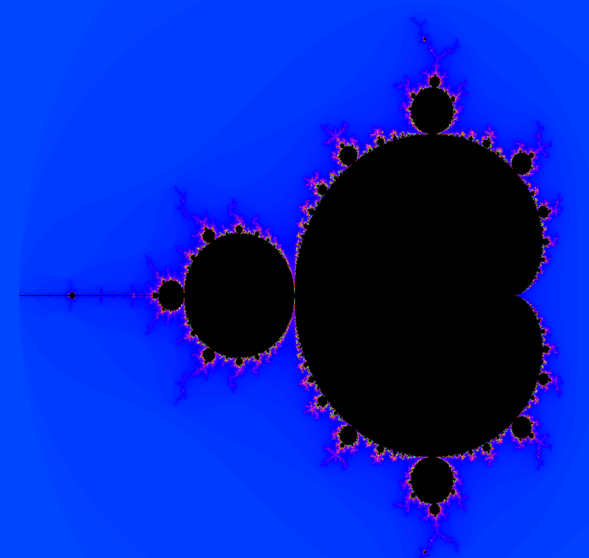

# Fract-ol - Interactive Fractal Renderer




## Table of Contents
1. [Description](#description)
1. [Features](#features)
3. [Installation and Usage](#installation-and-usage)
5. [Examples](#examples)

<video width="320" height="240" controls>
  <source src="demo/mandelbrotloop.mp4" type="video/mp4">
Your browser does not support the video tag.
</video>

## Description

Fract-ol is a powerful and interactive fractal rendering program implemented in C using the Minilibx library. It provides an intuitive interface for exploring the mesmerizing world of fractals, with support for popular fractal types including Mandelbrot, Sierpinski, and Julia.

## Features

Fract-ol provides a rich set of features that offer a captivating fractal exploration experience:

### Fractal Types: 
Visualize and explore different types of fractals including Mandelbrot, Sierpinski, and Julia.

### Interactive Zoom: 
Utilize the mouse scroll wheel to zoom in and out on different areas of the fractal, allowing for detailed exploration of its infinite complexity.

### Fractal Navigation (Panning): 
Click and drag to navigate around different areas of the fractal.

### Looping Color Change: 
Experience a looping color transition that adds a dynamic and visually stunning element to your fractal exploration.

### High Performance: 
Despite the intense computational requirements of fractal rendering, Fract-ol maintains smooth, real-time interaction for a seamless user experience.


## Installation and Usage
<details>
<summary>Click to expand</summary>

1. Clone the repository:
    ```bash
    git clone git@github.com:maxstocklin/fractol.git fractol
    ```

2. Navigate to the cloned repository:
    ```bash
    cd fractol
    ```

3. Compile the program using the provided Makefile:
    ```bash
    make
    ```
4. Run the Program with the name of the fractal you want as argument (Mandelbrot, Julia, or Sierpinski):
    ```bash
    ./fract-ol Mandelbrot
    ```
</details>

## Examples

### Mandelbrot

https://github.com/maxstocklin/fractol/assets/110395136/8e8d2d42-d3d2-427d-bd03-0be59bdbdb73

### Julia

https://github.com/maxstocklin/fractol/assets/110395136/689eb826-634e-4327-bada-ed0313e32851

### Panning

https://github.com/maxstocklin/fractol/assets/110395136/fc061e27-5bb5-45a6-9147-5dd8fd8db69c

### Noise effect

https://github.com/maxstocklin/fractol/assets/110395136/b87d895f-1c94-4b36-b3da-e461ca20240a


## Contributing

Fract-ol is an open-source project, and contributions are always welcome! If you have any bug reports, feature requests, or questions, please open an issue on this GitHub repository.

